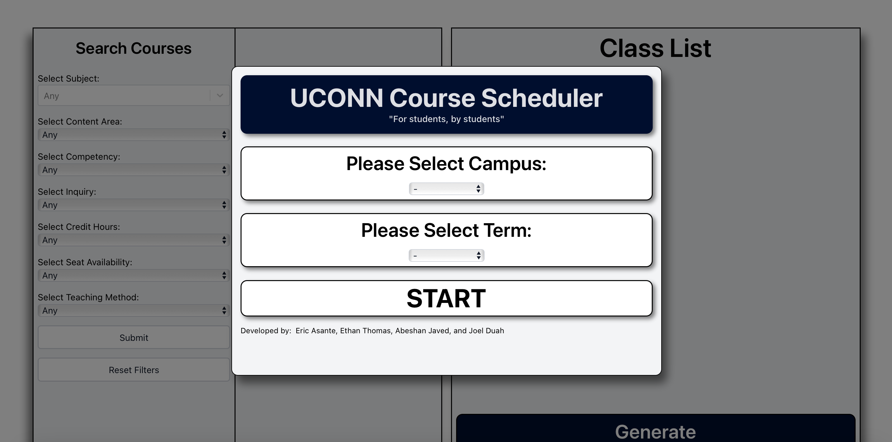

Senior at the University of Connecticut majoring in Computer Science and Engineering, with a minor in Electronics and Systems.

Brings a solid background in web and mobile development, with hands-on experience building real-time applications using modern APIs and frameworks.

Skilled in both software and hardware, with the ability to design responsive user interfaces, implement backend logic and APIs, and develop embedded systems.

Currently seeking full-time engineering opportunities in collaborative and innovative environments.

<h1>Projects</h1>

| 
 
<a href="https://github.com/EricAsante3/UCONN-course-scheduler.git"><b>UCONN Course Scheduler</b></a>

 | 
 
<a href="https://github.com/EricAsante3/AI-Content-Moderation-System.git"><b>AI Content Moderation System</b></a>

 |
| ------------------------------------------------------------------------------------------------ | -------------------------------------------------------------------------------------------- |
| 
 
<a href="https://github.com/EricAsante3/UCONN-course-scheduler.git"><b>Homepage</b></a>

 | 
 
<b>Homepage</b>

 |
